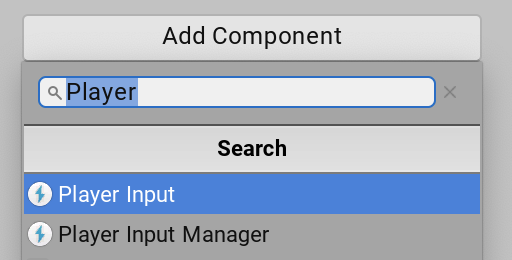
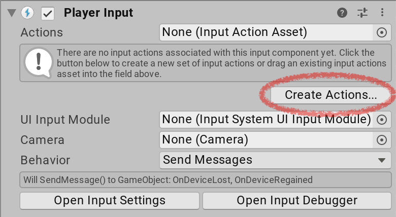
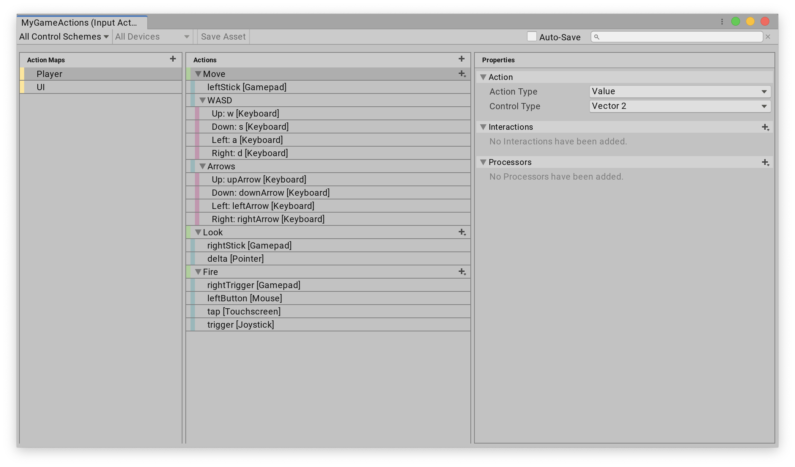
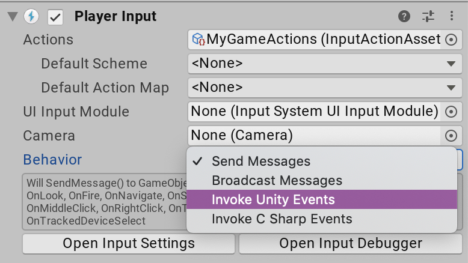
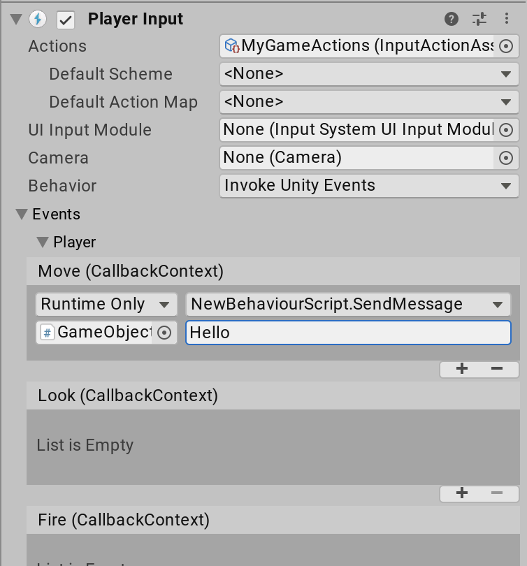

>__Note__: For information on how to install the new Input System, please see [Installation](Installation.md).

# Quick start guide

* [Getting input directly From an Input Device](#getting-input-directly-from-an-input-device)
* [Getting input indirectly through an Input Action](#getting-input-indirectly-through-an-input-action)

## Getting input directly From an Input Device

The quickest way to get started in script is to read the current state directly from Input Devices. For example, the following code grabs the gamepad last used by the player and reads its current state:

```CSharp
using UnityEngine;
using UnityEngine.InputSystem;

public class MyPlayerScript : MonoBehaviour
{
    void FixedUpdate()
    {
        var gamepad = Gamepad.current;
        if (gamepad == null)
            return; // No gamepad connected.

        if (gamepad.rightTrigger.wasPressedThisFrame)
        {
            // 'Use' code here
        }

        Vector2 move = gamepad.leftStick.ReadValue();
        // 'Move' code here
    }
}
```

The same approach works for other Devices types (for example, [`Keyboard.current`](../api/UnityEngine.InputSystem.Keyboard.html) or [`Mouse.current`](../api/UnityEngine.InputSystem.Mouse.html)).

## Getting input indirectly through an Input Action

>Overview:
>1. Add a `PlayerInput` component.
>2. Create Actions.
>3. Script Action responses.

### Step 1: Add a [`PlayerInput`](Components.md) Component

Getting input directly from an Input Device is quick and convenient, but requires a separate path for each type of Device. That also makes it harder to later change which Device Control triggers a specific event in the game.

Alternatively, you can use Actions as an intermediary between Devices and the in-game responses they trigger. The easiest way to do this is to use the [`PlayerInput`](Components.md) component. You can add the component using the __Add Component__ button in the GameObject Inspector:



### Step 2: Create Actions

Each [`PlayerInput`](Components.md) component represents one player in the game. To receive input, the component must be connected to a set of Input Actions. The quickest way to create a new set of Actions is to click the __Create Actions…__ button in the Inspector window for that component. This will create an Asset prepopulated with a default set of Input Action Maps, Input Actions, and Input Bindings.



When you click the __Create Actions…__ button, Unity asks you where to create the new asset. Choose a name and folder inside the *Assets* folder of your Project (or just accept the defaults) and click __Okay__. This creates a new `.inputactions` Asset in your Project, connects it to the [`PlayerInput`](Components.md) component, and brings up the editor window for `.inputactions` files.



You can edit the default set to fit the needs of your Project. See the in-depth documentation for the [Action editor](ActionAssets.md#editing-input-action-assets) for instructions on how to use this window.

## Step 3: Setting Up Action Responses

Once the component has its Actions, you must set up a response for each Action. [`PlayerInput`](Components.md) allows you to set up responses in several ways, using the __Behavior__ property in the Inspector window:



For more details about the options, see documentation on [notification behaviors](Components.md#notification-behaviors). The screenshot above uses __Invoke Unity Events__, which uses `UnityEvent` in the same way the Unity UI does. Unity displays an event for each Action that is linked to the component. This allows you to directly wire in the target method for each event.



Each method takes an [`InputAction.CallbackContext`](../api/UnityEngine.InputSystem.InputAction.CallbackContext.html) argument that gives access to the Control that triggered the Action and the Action's value. See documentation on  [Action  callbacks](Actions.md#started-performed-and-canceled-callbacks) for more details.

```CSharp
public class MyPlayerScript : MonoBehaviour
{
    public void Fire(InputAction.CallbackContext context)
    {
        Debug.Log("Fire!");
    }
}
```

This completes the basic setup using [`PlayerInput`](Components.md).

### Alternate ways to set up Input Actions

There are ways other than [`PlayerInput`](Components.md) to set up Input Actions. See documentation on [Creating Actions](Actions.md#creating-actions) for details.
